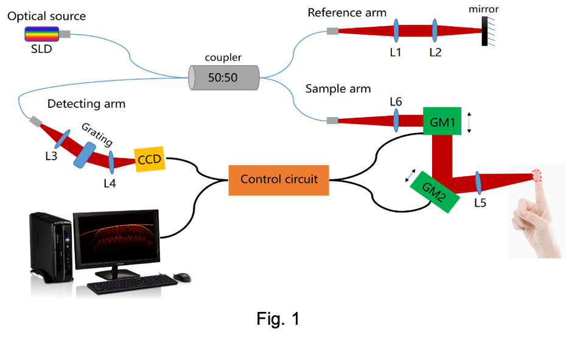
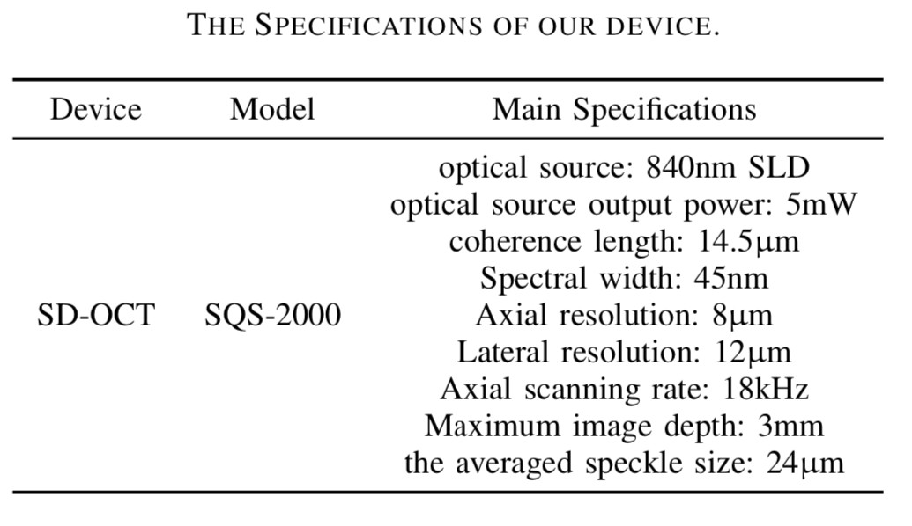
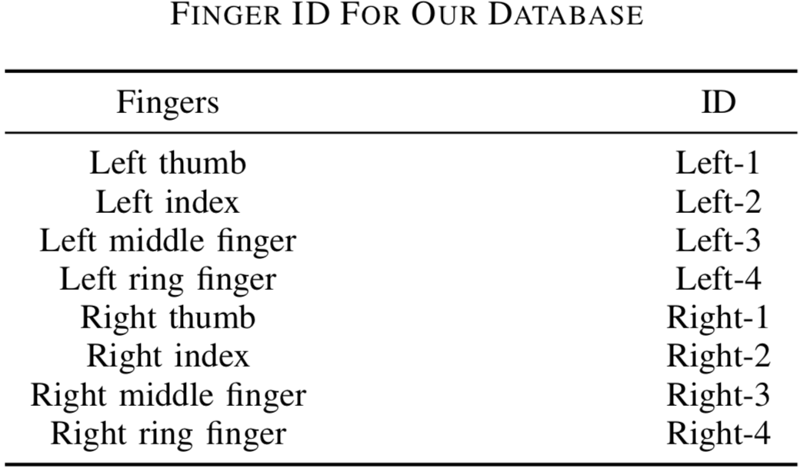
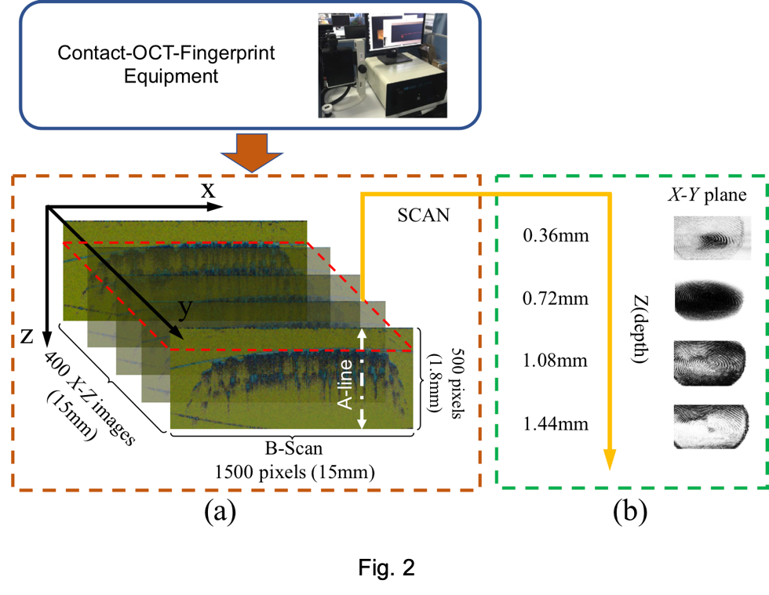

A-Benchmark-Database-using-Optical-Coherence-Tomography-for-Fingerprints
---

## Abstraction

Optical Coherence Tomography (OCT) is a high resolution imaging technology probing the internal structure of multilayered tissues. Since it provides subsurface fingerprint information which is identical to the surface texture but unaffected by any surface defects, OCT-based fingerprints open up a new domain for establishing robust and high security automatic fingerprint identification systems (AFISs). However, the development of OCT-based fingerprint recognition is hindered by the lack of public OCT-based fingerprint database for algorithm analysis and testing. This paper, **for the first time**, established an OCT-based fingerprint database with **thousands of fingers** using our custom-built acquisition device. Moreover, the images included in the database were selected after quality evaluation based on image resolution, noise and image size. Finally, case studies including anti-spoofing, multiple subsurface fingerprint reconstruction, and verification were discussed based on the developed database. The database can serve as a benchmark for developing effective anti-spoofing, live detection and high accurate fingerprint recognition algorithms. It will significantly promote the research in the area of fingerprint biometric and will also advance the development of commercial products.
### Contributor:

Feng.Liu: feng.liu@szu.edu.cn POST: Assistant prof. Organization:Shenzhen University

Linlin.Shen: llshen@szu.edu.cn POST: Prof. Organization:Shenzhen University

Haozhe.Liu: liuhaozhest@gmail.com Post:M.S. Organization: Shenzhen University

Caixiong.Shen, Guojie.Liu, Yahui.Liu, Wentian.Zhang, Yong.Qi

---
## How to Use the Benchmark?

1. You need to download the [protocol](./protocol.pdf) for our database. We trust that  the terms of this protocol are acceptable to you, and that you will be able to sign and email the attached copy of this protocol to us to confirm your agreement to its terms. The email address you can choose is
 - liuhaozhest@gmail.com,
 - feng.liu@szu.edu.cn,
 - zhangwentianml@gmail.com.

 Group Emailing is accepted and encouraged.

2. Then, there are two ways to get data:

- The first way is that we provide you with the Baidu cloud data links and you should download the data by yourself.
- The second way is that you provide us with your address. We send you the mobile hard disk in which the data is stored, but the necessary expenses (postage, the cost of mobile hard disk and labor, i.e.) need to be paid by you.

 You need to explain the way you choose in your email.

 Thank you very much for your cooperation!

---
## Our Contribution

OCT can not only acquire high-precision fingerprint images, but also provides the essence of internal fingerprint information that can effectively prevent attacks of different artificial fingerprints and solve the authentication problem when the surface of fingertip is changed or damaged. However, to the best of our knowledge, there is no public OCT-based database. Experimental validation and comparison of algorithms for OCT-based fingerprint recognition suffer from the lack of appropriate database. We therefore intended to build a OCT-based fingerprint database using our custom-built acquisition device for algorithm analysis and testing. In addition, we also proposed the evaluation criteria for the quality of fingerprint images, included in the established database--for the first time, to our knowledge. Our database can serve as a benchmark for developing robust and high-security fingerprint recognition algorithms. New features (e.g. sweat glands, papillary junction) provided by OCT-based fingerprint images will also significantly promote the research of AFISs and commerial products.

---
## Our Custom-built Experimental System

We choose SD-OCT technique to build our own fingerprint acquisition device. A typical spectral-domain OCT (SD-OCT) is a scanning imaging system based on the Michelson interferometer configuration with a super luminescent diode (SLD) in a source arm, a moving mirror in a reference arm, an object under study in a sample arm, and a spectrometer equipped with line-scan camera to measure output signal of interferometer in a detection arm. A schematic diagram of a fiber-based high speed SD-OCT fingerprint imaging system is shown in Fig. 1\. Low-coherence light from the optical source is split into two beams by a four-terminal fiber coupler and then incident on the reference mirror and the sample tissue respectively. A beam of light is projected through the achromatic lens to be reflected on the total reflection mirror as a reference light, while the other is focused on the sample tissue by the confocal lens system to become a signal light. Subsequently, the reference light and the backscattered signal light generate an interference signal through the fiber coupler. Such interference signal then exits the other end of the coupler into the spectral demodulation module, undergoes the grating dispersion and the detection by the CCD to finally obtain the spectral information. After processing, this spectral information can be used to obtain the intensity of the scattered light at different depths of the sample tissue.

It should be noted that our system is a touch-based acquisition device, which requires the finger to be placed on the glass window during collection. Since the finger is a curved object and the OCT scanner is set to maximize the reflectivity sensitivity at a certain depth, the glass window involved presses a finger against in order to flatten it out. The use of the glass window can also stabilize a finger pressed upon it and thereby reduces its involuntary jitter during scanning, while alleviating the problem of image depth-dependency roll-off in touchless OCT fingertip scans. Therefore, each finger should be gently pressed against the glass window of the probe, positioned at the center of the acquired image, then measured, and removed afterwards. Such operation was repeated two times for each finger.

---
## Benchmark Description

A total of 135 volunteers were recruited, most of them from students and a small number from staff in college with a relatively balanced distribution of age and gender. 70% of them are between 18 and 25 years old, and 30% are between 25 and 60 years old. The distribution of gender in the database is that no more than 10% difference between male and female volunteers. In particular, this small group of employees are engaged in long-term manual labor, so their external fingerprints may be in a relatively poor state (e.g., the pattern was damaged by some distortion such as cuts, scars and wear). This part of the data will be meaningful for verifying that OCT is a powerful tool to detecting internal fingerprints with identical topographical features (ridges and valleys) to the epidermis.

Since each sampling of the device is to acquire a set of 400 consecutive cross-sectional images, all of these images needs to be stored in a single folder. Two sets of data were captured from each of the eight fingers (i.e., thumb, index, middle and ring fingers on both right and left hands) of the subjects. Therefore, we need to create a home folder named Subject ID which contain 16(2*8) subfolders. The naming for each of the subfolders is the same, that is Finger ID - gender - Capture Order. The naming of the Finger ID is listed in this TABLE.

Now there are two kinds of databases: one has less fingertips with small storage, the other has the whole data.

---
## Data Description
Since the 3D fingerprints used in this project are quite different with traditional 2D fingerprints, we then introduce our data in detail.

Two identical telecentric lenses are used as a focusing lens and a scanning lens.
High-resolution tomography imaging of the internal microstructure of the biological tissue is performed by measuring the interference signal of the sample backscattered light.
Spectral information along the depth direction of fingertip skin, denoted by A-line as labelled in Fig. 2, is then obtained using a rate of 18 kHz,
which reach to a depth of about 1.8mm into the skin corresponding to 500 pixels.
The number of A-line in this paper is 1500,
so as to finally get a longitudinal(X-Z) fingertip images with spatial size of 500 × 1500 pixels, as shown in Fig. 2(a).

For 3D scanning, a slow scanning galvanometer is employed to obtain 400 B-scans.
Thus, the 3D fingerprint image captured by our device consists of four hundreds longitudinal(X-Z) fingertip images with spatial size of 500×1500×400 pixels to quantify a real fingerprint area of 15mm×15mm×1.8mm, as the example given in Fig. 2(a).
Fig. 2(b) shows the X-Y tomographic images of the 3D fingerprint, which is the same as traditional 2D fingerprint image but imaging at different depth.

---
## Important Things
1. The database uses our own protocol, so you should read the protocol in detail.
2. We consider this to be an important and promising research direction in Biometric and welcome any form of **academic cooperation** to promote the development of this field.
3. Statement for our open source data and software: **No commercial or illegal using.**

## Contact information
**Academic communication and discussion are welcome.**

- feng.liu@szu.edu.cn

- liuhaozhest@gmail.com

## Acknowledgement
The work is partially supported by the Natural Science Foundation of China (61672357 and U1713214), and the Science and Technology Funding of Guangdong Province (2018A050501014), the Shenzhen Fundamental Research fund JCYJ20180305125822769, the Education Department of Shaanxi Province (15JK1086), and Shaanxi University of Science and Technology Dr.Foundation (BJ14-07).
